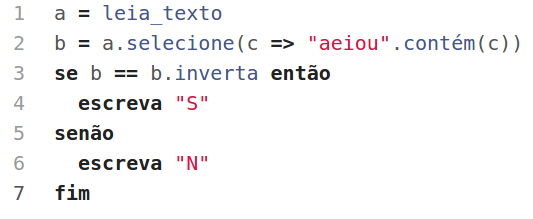

# Maratona de Programação da SBC

Solução das questões da Maratona de Programação promovida pela Sociedade Brasileira de Computação (SBC)
usando a linguagem [Potigol](http://potigol.github.io).

:balloon: Questões aceitas no [URI Online Judge](https://www.urionlinejudge.com.br) usando o script [Potigol2Scala](https://potigol.github.io/potigol2scala/)

## 2017
 - [Primeira Fase](http://maratona.ime.usp.br/vagas17.html): [Prova](http://maratona.ime.usp.br/prim-fase17/maratona.pdf)
   - [ ] **A**cordes intergaláticos (Difícil 5%)
   - [ ] **B**rincadeira (Muito Difícil 2%)
   - [ ] **C**igarras periódicas (Difícil 13%)
   - [ ] **D**espojados (Médio 18%)
   - [ ] **E**scala Musical (Médio 23%)
   - [X] [**F**ase](2017/fase1/F.poti) (Fácil 85%)
   - [ ] **G**inástica (Médio 16%)
   - [ ] **H**ipercampo (Difícil 8%)
   - [ ] **I**mposto Real (Difícil 11%)
   - [X] [**J**ogo de Boca](2017/fase1/J.poti) (Fácil 50%)
   - [ ] **K**-ésimo (Muito Difícil 1%)
   - [ ] **L**aboratório de biotecnologia (Muito Difícil 1%)
   - [X] [**M**áquina de café](2017/fase1/M.poti) (Fácil 89%)

## 2016
 - [Primeira Fase](http://maratona.ime.usp.br/vagas16.html): [Prova](http://maratona.ime.usp.br/prim-fase16/maratona.pdf)
   - [X] [**A**ndando no tempo](2016/fase1/A.poti) (Fácil 99%) :balloon:
   - [ ] **B**atata quente (Muito Difícil 0,3%)
   - [ ] **C**ontainers (Difícil 8%)
   - [X] [**D**ivisores](2016/fase1/D.poti) (Médio 27%)
   - [ ] **E**statística hexa (Muito Difícil 0,4%)
   - [ ] **F**undindo árvores (Difícil 9%)
   - [ ] **G**o-- (Difícil 8%)
   - [X] [**H**uaauhahhuahau](2016/fase1/H.poti) (Fácil 88%) :balloon:
   - [ ] **I**sósceles (Médio 22%)
   - [ ] **J**ogos olímpicos (Muito Difícil 0,5%)
   - [ ] **K**it de encolhimento de polígonos (Muito Difícil 0,1%)
   - [ ] **L**adrilhos (Médio 31%)

 - [Segunda Fase](http://maratona.ime.usp.br/vagas16.html): [Prova](http://maratona.ime.usp.br/prim-fase16/maratona.pdf)
   - [X] [**A**ssigning Teams](2016/fase2/A.poti) (Fácil 100%) :balloon:
   - [ ] **B**ack to the Future (Difícil 26%)
   - [ ] **C**ounting Self-Rotating Subsets (Muito Difícil 3,4%)
   - [ ] **D**ating On-Line (Médio 79%)
   - [ ] **E**mission Spectrum (???)
   - [ ] **F**arm robot (Fácil 100%)
   - [ ] **G**ame of Matchings (Muito Difícil 5,2%)
   - [ ] **H**otel Rewards (Difícil 24%)
   - [ ] **I**nternet Trouble (Muito Difícil 6,9%)
   - [ ] **J**ust in Time (Médio 55%)
   - [ ] **K**ill the Werewolf (Médio 41%)

